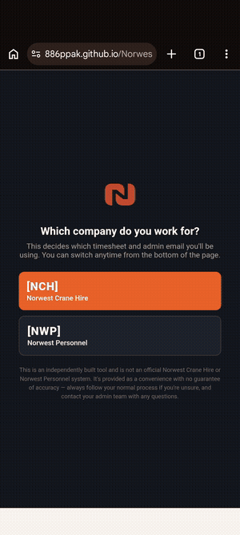

# Norwest Crane Hire — Weekly Timesheet PWA

A single-page Progressive Web App that replaces the paper/PDF weekly
timesheet (**NCH-HR-FORM-025**) used by Norwest Crane Hire. Employees fill
it out and sign it on their phone, the app generates a PDF that closely
matches the original company form, and it's shared straight to
`admin@norwestcranehire.com.au`.

**Live app:** https://886ppak.github.io/Norwest-Forms/

## Features

- 📱 **Installable PWA** — add to home screen, works fully offline after
  the first load (service worker caches the app shell + PDF library).
- 🗓️ **Auto-filled week** — pick a "Week Ending" date and all 7 daily dates
  populate automatically.
- 🔢 **Job number lookup** — selecting a client auto-fills the correct job
  number for that month from a live company spreadsheet.
- ✍️ **On-screen signature** — required before you can download or submit.
- 📄 **PDF generation** — produces a PDF that closely replicates the
  original paper form, including job details, daily hour totals, leave
  legend, and allowance calculations.
- 📤 **One-tap submit** — uses the Web Share API to hand the finished PDF
  straight to your phone's Gmail app, ready to send.
- 🔁 **Start new week** — resets the timesheet for the next week while
  keeping your name and signature saved.

## Usage

Quick way to fill out your weekly timesheet (or leave application) on your
phone and send it straight through — no more paper forms.

1. Open the [live app](https://886ppak.github.io/Norwest-Forms/) on your phone.
2. First time you open it, pick your company (NCH or NWP) — you can switch
   anytime from the bottom of the page.
3. **Install it to your home screen** for the best experience — tap the
   **⋮** menu (top right in Chrome) → **Install and create shortcut** →
   confirm:

   

4. Fill in your name, week ending date, hours for each day, and sign at
   the bottom.
5. Hit **Submit & Send** — it copies the admin email to your clipboard and
   opens Gmail with your timesheet attached, just paste the email in and send.
6. Works offline once installed, so you can fill it out even with no signal
   and send when you're back in range.

No account or login required. This is an independently built tool, not an
official Norwest Crane Hire or Norwest Personnel system — that's flagged
on the first-open screen too.

## Tech stack

Plain HTML/CSS/JavaScript — no build step, no framework. PDF generation is
handled by [jsPDF](https://github.com/parallax/jsPDF), loaded from a CDN
and cached by the service worker for offline use.

## Project structure

```
index.html         # the entire app: UI, state, and PDF generation
manifest.json       # PWA manifest (icons, app name, install prompt)
service-worker.js   # offline caching + auto-update logic
icons/               # app icons
docs/                # README assets (e.g. the install walkthrough gif)
```

## Local development

This is a static site with no build step — just serve the folder and open
it in a browser:

```bash
python3 -m http.server 8000
# then visit http://localhost:8000
```

Deployment is via GitHub Pages from the repo root, so pushing to `main`
publishes the live site directly.

## Contributing

This is a small, purpose-built internal tool for Norwest Crane Hire.
See [`PROJECT_CONTEXT.md`](./PROJECT_CONTEXT.md) for implementation notes,
business-logic details, and things that shouldn't be changed without
checking first — read it before submitting changes.
